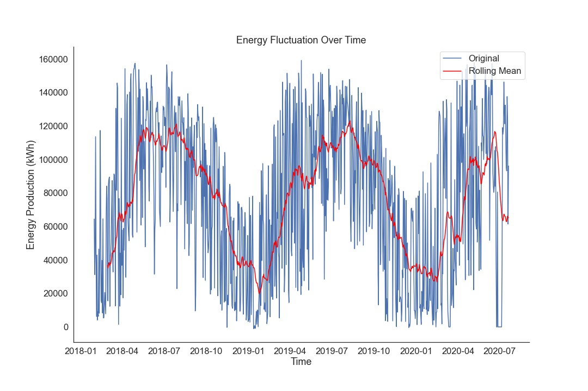
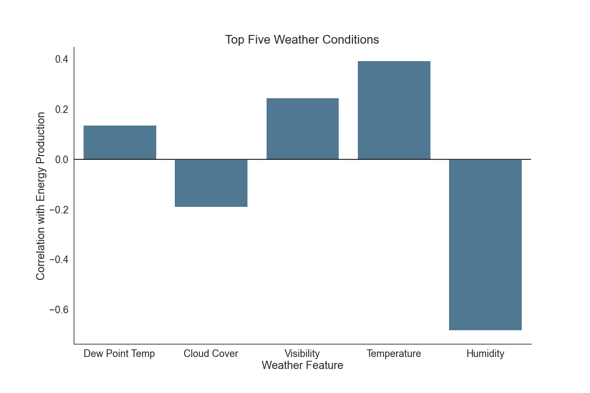
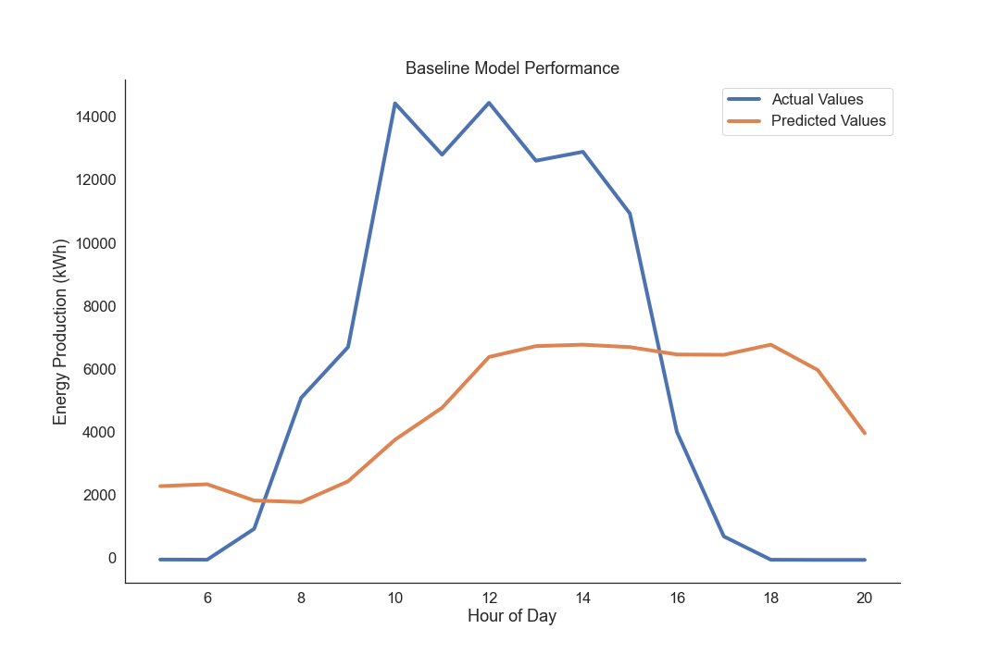
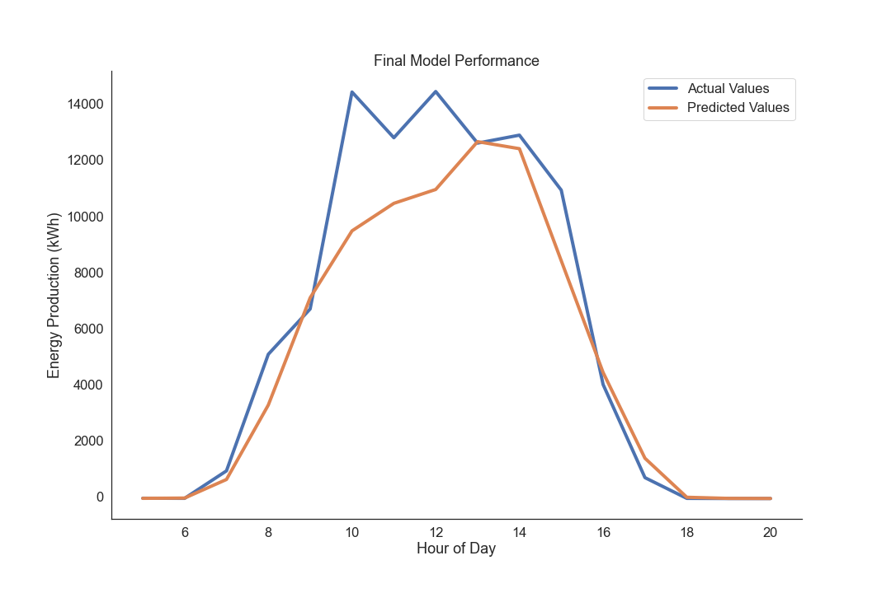

# Solar Energy Forecasting

Analysis by Matt Carr

## Repo Contents
- [Exploratory Notebooks](https://github.com/mattcarr17/solar_energy_prediction/tree/master/notebooks/exploratory)
- [Report Notebook](https://github.com/mattcarr17/solar_energy_prediction/blob/master/notebooks/report/final_notebook1.ipynb)
- [Project Presentation](https://github.com/mattcarr17/solar_energy_prediction/blob/master/report/Presentation.pdf)
- [Project Data](https://github.com/mattcarr17/solar_energy_prediction/tree/master/data)
- [Energy Data Web Scraper](https://github.com/mattcarr17/solar_energy_prediction/blob/master/src/web_scraper.py)
- [References](https://github.com/mattcarr17/solar_energy_prediction/tree/master/references)
- [Project Source Code](https://github.com/mattcarr17/solar_energy_prediction/tree/master/src)
- [Project Visuals](https://github.com/mattcarr17/solar_energy_prediction/tree/master/report/figures)
- [Conda Environment](https://github.com/mattcarr17/solar_energy_prediction/blob/master/environment.yml)

## Table of Contents
- [Introduction](##Introduction)
- [Project Overview](##Project-Overview)
- [Data](##Data)
- [Data Preparation](##Data-Preparation)
- [Modeling](##Modeling)
- [Results](##Results)
- [Next Steps](##Next-Steps)
- [References](##References)

## Introduction

Over the past decade, renewable energies have seen massive growth due to decreasing costs and obvious environmental benefits compared to conventional energy sources. [2, 1] However, due to their intermittent nature, itegrating these sources into the current electric grid has proved challenging. The way our current grid operates, energy consumption (energy leaving the grid) must balance energy generation (energy entering the grid) at any given time. [2] If this balance is not kept, it can lead to grid failures that can produce power outages and black outs. Conventional energy production can be turned on and off at will, allowing for easy control of how much energy is entering the grid. In order to keep the balance between energy consumption and energy generation, the total energy produced from renewable sources and conventional sources must match the energy demand at any given time. [1]

Due to their dependence on weather conditions, which can change unexpectedly, it is difficult to predict how much energy renewable sources will produce, and how much energy must be produced from other sources to keep the grid balanced. What is required for grid operators is an accurate prediction of how much energy will be produced from renewable sources, so they can know in advance how much of the remaining demand will have to be met by other sources.[2] Knowing this information even a few hours in advance can drastically improve grid efficiency and reliability.

## Project Overview

The goal of this project is to create a model that can predict the short term energy production of solar panels. This analysis is meant to provide accurate predictions of solar energy production to grid operators, in hopes that this will allow them to be more efficient in the use of other energy sources and reduce the frequency these sources are used. The analysis performed in this project utilized current weather observations to predict solar energy production three hours in advance.

This analysis was done on the University of Illinois' Solar Farm, which supplies approximately 2% of all electricity to the Urbana campus. [4] Using the current weather conditions in Champaign, the model will be able to estimate the amount of solar energy supplied to the campus three hours in advance.

### Conda Environment
To run through the code in this project repo, you must first download and activate the Anaconda environment used for this project. This contains all of the libraries and packages needed to do the analysis. If you have Anaconda installed on your computer, this is simple to do. After you have cloned and downloaded the project repo, you can activate the environment by navigating to the base project repo in your terminal and running the following commands:
    conda env create -f environment.yml
    conda activate capstone
Instructions on how to do this can be found [here](https://docs.conda.io/projects/conda/en/latest/user-guide/tasks/manage-environments.html)

## Data

As mentioned previously, this project utilizes data from two sources. The energy data was scraped from the University of Illinois' Solar Farm [Dashboard](http://s35695.mini.alsoenergy.com/Dashboard/2a5669735065572f4a42454b772b714d3d). The weather data was downloaded from the NOAA Local Climatological Data [access point](https://www.ncdc.noaa.gov/cdo-web/datatools/lcd). There are three weather stations around the Solar Farm, unfortunately only one of these provided the weather data needed for analysis. Station WBAN:94870 was used for this project.

This project used energy and weather data from January 29, 2018 to July 20, 2020, all of which is already stored in the data directory of this repo. A link to which can be found at the top of this document. The energy data is located under data/solar_output/ and weather is located under data/weather/.

Between these two datasets, I was presented with the following variables:
- nexus_meter -> Energy produced from solar farm in kilowatt hours
- HourlyAltimeterSetting -> atmospheric pressure reduced to sea level. Given in Hg (inches of Mercury)
- HourlyDewPointTemperature -> dew point temperature in F
- HourlyDryBulbTemperature -> Temperature in F
- HourlyRelativeHumidity -> Humidity given in nearest whole percentage
- HourlyStationPressure -> atmospheric pressure at station in Hg (inches of Mercury)
- HourlyVisibility -> Horizontal distance an object can be seen given in whole miles
- HourlyWindSpeed -> speed of wind in mph
- HourlyWindDirection -> Wind direction from true north using compass directions
- HourlyPrecipitation -> Amount of precipitation in inches
- HourlySkyConditions -> Sky conditions in layers of cloud cover

Using these features I also created three additional variables:
- week -> week of year energy was produced
- hour -> hour of day energy was produced
- cloud_coverage -> percentage of sky covered by clouds

The data stored in this repo is sufficient to run through the analysis. However, if you wish to add additional data you can do so. You can download more weather data [here](https://www.ncdc.noaa.gov/cdo-web/datatools/lcd), just make sure you select the station mentioned above. To download additional energy data you can utilize the web scraper present in this repo. Simple instructions on how to download this data is located in the final notebook. Be sure you have energy and weather data for the same time period.

## Data Preparation

I needed to explore the data to get an idea of what I was working with as well as format the data correctly prior to modeling. The main thing I wanted to explore was how energy production fluctuated over time as well as with weather conditions. In other words how strong was its relationship with weather conditions. After exploration, I needed to process and format the data in a way that allowed me to make predictions for three hours in the future using current weather conditions. All of this is explained below.

### Data Exploration

The first thing I wanted to investigate was how solar energy production fluctuated over time. To do this, I plotted the total daily energy production over the given time period as wella as the average monthly production. This would allow me to see how energy fluctuated on a day to day basis, as well as what the overall trend was over time.

This plot provides some important information. First, looking at the red line which denotes the thirty day rolling mean and highlights the overall trend of energy production throughout the year, we can see that energy production is much higher in warmer months than cooler months. The plot reaches its relative minimum in the Winter and begins rising in early Spring, reaching its relative peak around the middle of the Summer. This is why including the week of the year we are predicting for is so important for the model's results, because the time of year has a strong affect on how much energy is being produced.

The other thing we can see from the plot above is the immense amount of noise in the original daily plot (blue line). This is due to the influence that weather conditions have on solar energy production, and the natural fluctuations of weather conditions. Although the time of year is a strong indication of how much energy may be produced, weather conditions cannot be overlooked. Looking at a few of the days in January 2019, we can see that they actually produced more energy than a few days in June of that same year. This is because weather has such a strong influence on energy production; a sunny day in January will produce more energy than a cloudy day in June. 

In order to produce the best predictions, both time and weather must be taken into account.

Next I wanted to see how dependent the energy production was on the weather conditions. To do this I created a bar plot that shows the weather conditions with the top five absolute correlations with energy production.

As you can see from the plot above, solar energy production has a fairly strong relationship with a few different weather conditions. The three bars above the horizontal black line have a direct relationship with energy production, while the two below have an indirect relationship. These all make sense when you consider how they affect solar irradiance reaching the solar panels. For example, when temperature is higher, it typically means more sunlight is reaching the surface of the Earth, this in turn allows for more solar energy to be produced. [5] As visibility goes up and there is less fog or air particles preventing solar energy from reaching the panels, more energy can be produced. In that same sense, when there is more cloud cover, less solar irradiance is able to reach the solar panels and this decreases the amount of energy they create. Humidity is an interesting one. We can see from the plot that humidity has the strongest affect on how much energy is produced. As humidity increases, small water droplets can form on the solar panels themselves, preventing the solar energy from reaching the panel directly. In addition to that, the moisture in the air can damage the panels, making them less efficient and unable to produce as much solar energy. [5, 6]

### Data Processing

After I had explored the data and knew what I was working with, it was time to process the data in order to create models. All cleaning steps can be found in data_gathering.py under the src/ directory and all processing steps can be found in data_processing.py in the same directory

The first order of business was to aggregate both the energy and weather data into an hourly time index. For the energy data, this was simple. The energy data comes in fifteen minute increments and after converting the data type from string to float, I summed up the energy production for each fifteen minute increment to get total energy production in a given hour. Using the energy data I also added two columns: week and hour. The week column indicates the week of the year this energy was produced, and hour indicates the hour of day the energy was produced. Since energy production was so dependent on time, these seemed like beneficial features to add.

In order to aggregate the weather data, I first had to clean the data and impute the missing values. For starters, there were a few columns in the weather dataframe that had extraneous letters present after the numerical value. Before I could convert the data type to float, I had to remove these letters. After doing so, there were a few values in the dataframe that indicated a missing value so these had to be converted to np.nan. Specifically, the /* and a blank space meant a missing value. Once these were accounted for, I was able to convert the data types to float and impute the missing data.

For imputation I used the [IterativeImputer](https://scikit-learn.org/stable/modules/generated/sklearn.impute.IterativeImputer.html) tool from sklearn. This is a multivariate imputation method which means it takes other variables into account other than the column missing the value. IterativeImputer runs a regression on each row missing a value, using the other columns as predictors to impute the missing value. Considering the relationships between weather conditions, this seemed the best strategy to use. After the missing data was imputed, I was able to aggregate the weather data into an hourly time index, using the mean of weather conditions over the hour as the hourly value.

Once both dataframes were in hourly format I could combine them into a single dataframe. In order to use current weather conditions to predict solar energy production three hours in the future, I incorporated a three hour lag when concatenating the data. So each energy value was in the same row as the weather conditions three hours before it. The final thing I did before modeling was subset this dataframe to only include the observations between 5am and 8pm as these were the times energy was actually being produced.

## Modeling

I began by running a simple baseline model so that I could see how future model iterations were improving. I utilized a LinearRegression model for the baseline and only included the weather conditions as features. The time of year and of day were not included until future iterations. This baseline model produced an RMSE of 5,131 on the testing data.

Above you can see how well the baseline model predicted the energy production compared to what the energy production actually was. As you can see the model's predictions did not line up with the actual values very well. These are the results for October 19, 2019. It's important to note that these predictions were not all done prior to the day beginning. Each prediction was made three hours in advance. For example, the prediction for 5pm was made at 2pm using the current weather conditions. Overall this model did not perform very well.

The final model performed much better. I used a RandomForestRegressor for the final model and included the time features as well. The hyperparemeters for the final model are as follows:
- max_depth = 25
- n_estimators = 250
- min_impurity_decrease = .25

I increase the number of estimators to get a larger number of prediction to average, and hopefully improve overall model predictions. Max_depth and min_impurity_decrease are set to prevent the model from splitting over a small change in one of the weather features, which won't change the solar energy production all that much.

The final model produced an RMSE of 2,297 on the testing data. Which means that the model's predictions were off by an average of 2,297. Considering that the target value ranges from 0 to 17,500 this is still not that great. Below you can see how the final model's predictions lined up with the actual values for October 19, 2019. 

As you can see the final model did much better than the baseline model. However, both of these plots only show one days worth of predictions. On other days, the model's predictions did not line up as well as this day.

## Results

Although the final model showed great improvement compared to the baseline model, it is still not quite as accurate as I would like it to be. Short term predictions such as these should be at least 90% accurate to improve grid operations, which these are not. This is still the first stage of the project and taking that into consideration these results are promising.

## Next Steps

The current model would not provide accurate enough predictions to improve integration of renewable sources into the grid. There are a few things I can apply to the next stages of this project to improve predictions. First I would like to gather hourly solar radiation data from Champaign, IL where the solar farm is located. Solar radiation is the energy from the sun that the solar panels convert into electricity and is the main predictor of how much solar energy will be produced. With the addition of this information, the weather conditions would simply be a measurement of how much of this energy is prevented from reaching the solar panels. This will have the greatest affect on model performance so this is primary next step I am focused on.

In addition to gathering more data, I would also like to experiment with other machine learning techniques. Primarily, time series modeling. With time series modeling, instead of just predicting three hours in the future as the current model does, I would be able to produce a forecast that spans from one to six hours in advance. Using solar radiation and weather conditions as exogenous variables, this method would likely produce good results.

Finally I would like to create an intuitive dashboard that can give regular solar energy productions. This would provide grid operators a simple tool to guage how much solar energy would be produced in the future.

## References
- [1] Cleary & Palmer. [Renewables 101: Integrating Renewable Energy Sources into the Grid.](https://www.rff.org/publications/explainers/renewables-101-integrating-renewables/)
- [2] EIA. [U.S. renewable electricity generation has doubled since 2008](https://www.eia.gov/todayinenergy/detail.php?id=38752)
- [3] Kelly, Jack. [Starting work on solar electricity forecasting](https://jack-kelly.com/blog/2019-07-01-starting-solar-electricity-nowcasting)
- [4] University of Illinois. [Solar Farms](https://fs.illinois.edu/services/utilities-energy/production/solar-farms)
- [5] Ayegba, Abdul, Joshua. [Impacts of Relative Humidity and Relative Mean Air Temperature on Solar Radiation](http://www.ijsrp.org/research-paper-0217/ijsrp-p6246.pdf)
- [6] Glenn. [How Do Wind and Humidity Affect Solar Panel Efficiency](https://www.solar.com/learn/how-do-wind-and-humidity-affect-solar-panel-efficiency/)

